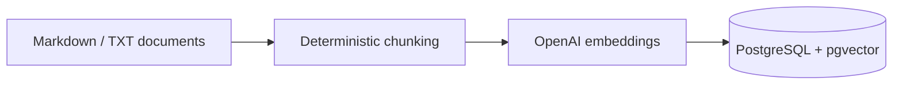

# AI Knowledge Assistant — RAG + n8n

A functional **Retrieval-Augmented Generation (RAG)** portfolio project built with **Python, FastAPI, OpenAI, PostgreSQL/pgvector, Docker and n8n**.

The assistant retrieves relevant knowledge-base chunks before generation, returns the answer with its accepted sources and similarity scores, and exposes a `grounded` flag. If retrieval does not find sufficient evidence, the system **abstains instead of inventing an answer**.

> **Portfolio boundary:** all knowledge-base documents in this repository are fictional. No confidential company data, credentials or internal processes are included.

## v1.0 status

**Functional and locally validated end to end.** The request path has been tested from the published n8n webhook through the FastAPI RAG service and back to the client.

| Capability | v1.0 |
|---|---|
| FastAPI REST API | ✅ |
| Markdown/TXT ingestion | ✅ |
| deterministic chunking + overlap | ✅ |
| OpenAI embeddings | ✅ |
| PostgreSQL + pgvector | ✅ |
| cosine-similarity retrieval | ✅ |
| configurable top-k | ✅ |
| minimum similarity safeguard | ✅ |
| source-grounded LLM generation | ✅ |
| explicit insufficient-evidence fallback | ✅ |
| n8n webhook orchestration | ✅ |
| Docker Compose | ✅ |
| automated regression tests | ✅ |
| GitHub Actions deterministic CI | ✅ |

## Architecture

```mermaid
flowchart LR
    U[Client / User] -->|POST question| N[n8n Webhook]
    N --> V[Validate Question]
    V --> A[FastAPI /ask]
    A --> E[OpenAI Embeddings]
    E --> R[pgvector Retrieval]
    R --> T{score >= 0.45?}
    T -->|No| F[Safe fallback]
    T -->|Yes| C[Retrieved context]
    C --> L[LLM generation]
    L --> O[Answer + sources + grounded=true]
    F --> X[Answer + sources=[] + grounded=false]
```

Document ingestion is a separate path:



For a more detailed architecture and the validated positive/negative cases, see [`docs/architecture.md`](docs/architecture.md).

## Key design decision: do not answer everything

A nearest vector is not automatically valid evidence. The current portfolio baseline uses:

```env
RETRIEVAL_MIN_SCORE=0.45
```

Retrieved chunks below the threshold are discarded **before generation**. With no accepted context, the API returns a deterministic insufficient-evidence response, an empty `sources` list and `grounded: false`.

This value was calibrated against the small fictional demo corpus. It is not presented as a universal production threshold.

## Validated behavior

### Supported question

```text
How do I request a notebook?
```

Validated result:

```json
{
  "sources": [
    {
      "document": "it_equipment_policy.md",
      "score": 0.6238
    }
  ],
  "grounded": true
}
```

### Unsupported question

```text
What is the company's vacation policy?
```

Validated result:

```json
{
  "answer": "There is not enough evidence in the knowledge base to answer this question.",
  "sources": [],
  "grounded": false
}
```

That negative case is intentional: the assistant should know when its knowledge base does **not** support an answer.

## Automated validation

The complete Dockerized suite was validated locally on **September 3, 2026**:

```text
collected 9 items
9 passed, 1 warning
```

The suite covers chunking, API health, input validation, three expected RAG grounding cases and one unsupported-question abstention case. The observed warning was a Starlette/AnyIO dependency deprecation warning, not an application-test failure.

Public GitHub Actions CI intentionally runs only deterministic tests that do not require an OpenAI credential or live vector database:

```bash
pytest -q tests/test_chunking.py tests/test_health.py
```

The RAG evaluation tests are integration-style tests and may consume configured API credits.

## Project structure

```text
app/
├── api/
│   ├── routes.py
│   └── schemas.py
├── core/
│   ├── config.py
│   └── database.py
├── rag/
│   ├── chunking.py
│   ├── embeddings.py
│   ├── generation.py
│   ├── ingestion.py
│   ├── models.py
│   └── retrieval.py
└── main.py

data/sample_docs/          fictional knowledge base
docs/                      architecture + validation notes
n8n/workflows/              importable n8n workflow
tests/                      automated regression suite
```

## Local setup

### Requirements

- Docker Desktop with WSL 2/virtualization enabled on Windows
- Git
- an OpenAI API key with API billing/credits available

### Clone and configure

```bash
git clone https://github.com/Sembla/ai-knowledge-assistant-rag-n8n.git
cd ai-knowledge-assistant-rag-n8n
```

PowerShell:

```powershell
Copy-Item .env.example .env
notepad .env
```

Set the local key:

```env
OPENAI_API_KEY=your_key_here
```

Never commit `.env`; it is ignored by `.gitignore`.

### Start the stack

```bash
docker compose up -d --build
```

Services:

- FastAPI: `http://localhost:8000`
- Swagger: `http://localhost:8000/docs`
- n8n: `http://localhost:5678`
- PostgreSQL/pgvector: `localhost:5432`

### Health check

```http
GET /health
```

Expected:

```json
{"status":"ok"}
```

### Ingest the fictional knowledge base

From Swagger:

```http
POST /ingest
```

Expected shape:

```json
{
  "documents": 3,
  "chunks": 3
}
```

The exact chunk count can change when documents or chunk settings change.

### Ask through the API

```http
POST /ask
Content-Type: application/json

{
  "question": "How do I request a notebook?"
}
```

### Run the full local suite

```bash
docker compose exec api pytest -v
```

## n8n orchestration

Import:

```text
n8n/workflows/knowledge-assistant-webhook.json
```

The workflow is intentionally small and inspectable:

```text
Question Webhook
      ↓
Validate Question
      ↓
Call RAG API
      ↓
Return Answer
```

Because n8n and FastAPI share the Docker Compose network, n8n calls `http://api:8000/ask`.

## Configuration

| Variable | Purpose |
|---|---|
| `OPENAI_API_KEY` | local API credential |
| `OPENAI_CHAT_MODEL` | response-generation model |
| `OPENAI_EMBEDDING_MODEL` | embedding model |
| `EMBEDDING_DIMENSIONS` | pgvector dimension |
| `RETRIEVAL_TOP_K` | maximum retrieved chunks |
| `RETRIEVAL_MIN_SCORE` | minimum similarity accepted as evidence |
| `CHUNK_SIZE` | maximum chunk size in characters |
| `CHUNK_OVERLAP` | repeated context between adjacent chunks |

## Reliability controls

- generation is constrained to retrieved context;
- low-confidence retrieval is rejected before generation;
- no accepted context produces a deterministic fallback;
- returned sources and scores make retrieval inspectable;
- API input is validated with Pydantic;
- database health is checked before the API starts;
- services are isolated with Docker Compose;
- secrets remain outside Git through `.env`.

## What this project demonstrates

Hands-on portfolio evidence of **RAG architecture, embeddings, vector similarity search, pgvector, retrieval thresholds, LLM API integration, FastAPI, REST/webhooks, n8n orchestration, Docker, automated testing, source traceability and explicit insufficient-knowledge handling**.

## Scope and v2 backlog

This is a functional learning/portfolio implementation, **not an enterprise-scale production deployment**.

Possible v2 work:

- observability and request tracing;
- latency/token/cost metrics;
- retries/backoff for external APIs;
- larger evaluation dataset and retrieval metrics;
- reranking;
- authentication and rate limiting;
- cloud deployment;
- controlled CI integration tests;
- Flowise comparison;
- optional MCP interface.
