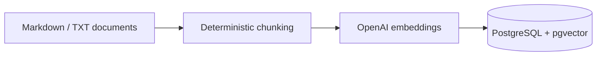

# Architecture and validation — v1.0

## System flow

```mermaid
flowchart LR
    U[Client / User] -->|POST question| N[n8n Webhook]
    N --> V[Validate Question]
    V --> A[FastAPI /ask]
    A --> E[OpenAI Embeddings]
    E --> R[pgvector Retrieval]
    R --> T{score >= 0.45?}
    T -->|No| F[Insufficient-evidence fallback]
    T -->|Yes| C[Retrieved context]
    C --> L[LLM generation]
    L --> O[Answer + sources + grounded=true]
    F --> X[Answer + sources=[] + grounded=false]
```

## Ingestion flow



## Why the threshold exists

The assistant does not treat every nearest-neighbor result as valid evidence. Retrieved chunks below `RETRIEVAL_MIN_SCORE=0.45` are rejected before generation. In the current fictional evaluation corpus, this separates the supported questions from an intentionally unsupported vacation-policy question.

The threshold is a portfolio baseline calibrated against this small corpus, not a universal production value.

## Validation evidence

The v1 implementation was validated locally on September 3, 2026.

### Automated suite

```text
collected 9 items
9 passed, 1 warning
```

Coverage includes:

- chunk splitting and overlap;
- blank-input and invalid-overlap behavior;
- API health;
- question input validation;
- expected grounding for notebook, access-management and purchasing questions;
- abstention for an unsupported question.

The warning was a dependency deprecation warning from the Starlette/AnyIO test stack and did not represent an application failure.

### End-to-end positive case

Question:

```text
How do I request a notebook?
```

Observed result:

```json
{
  "sources": [
    {
      "document": "it_equipment_policy.md",
      "score": 0.6238
    }
  ],
  "grounded": true
}
```

The request was sent to the published n8n webhook, which called the FastAPI RAG endpoint and returned the grounded response.

### End-to-end negative case

Question:

```text
What is the company's vacation policy?
```

Observed result:

```json
{
  "answer": "There is not enough evidence in the knowledge base to answer this question.",
  "sources": [],
  "grounded": false
}
```

This is the key safety behavior of the demo: insufficient retrieval evidence results in abstention rather than an unsupported generated answer.

## Portfolio boundary

All sample documents are fictional and exist only to demonstrate the architecture. This repository is a functional portfolio/learning implementation, not an enterprise production deployment.